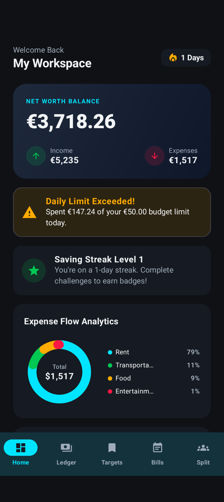
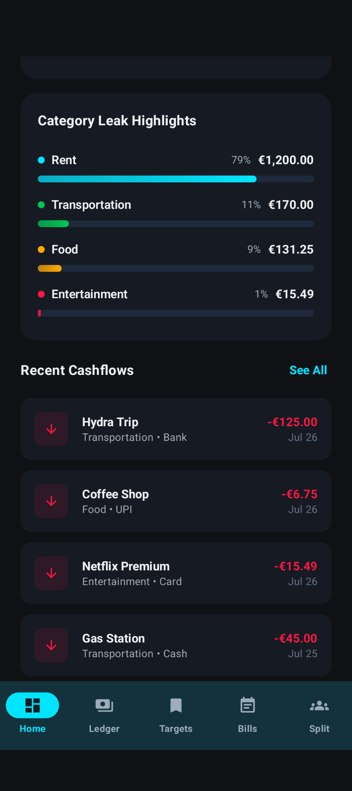
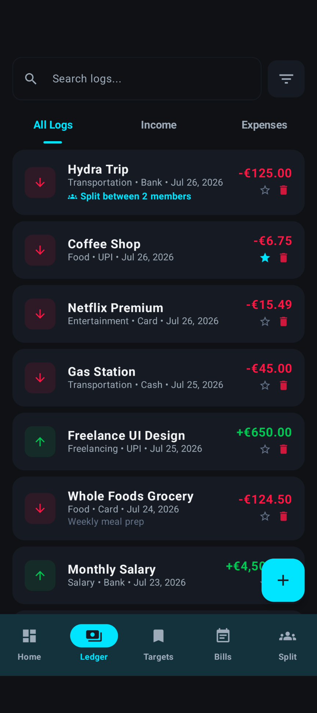
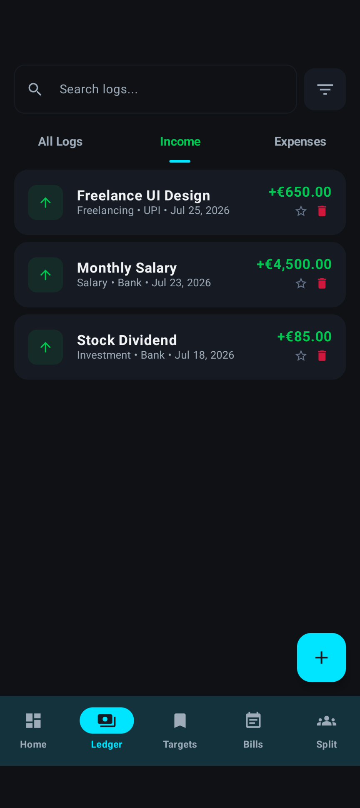
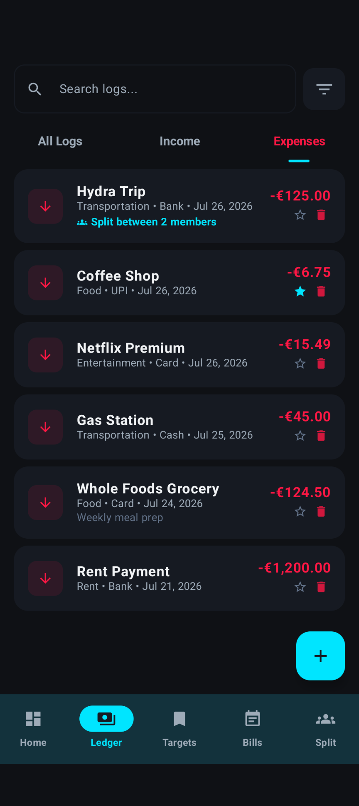
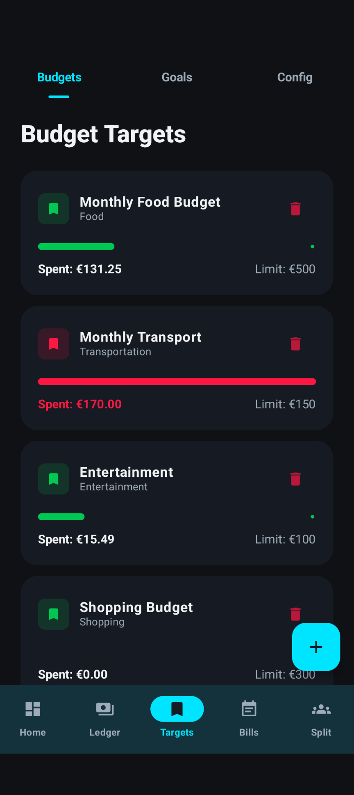
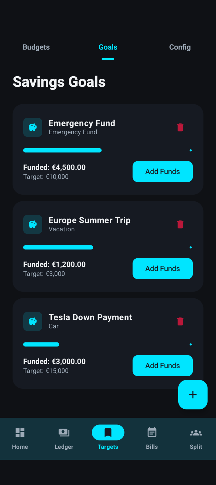
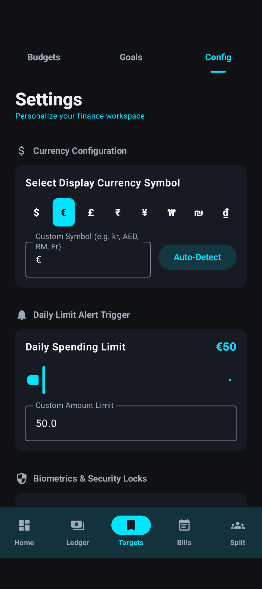
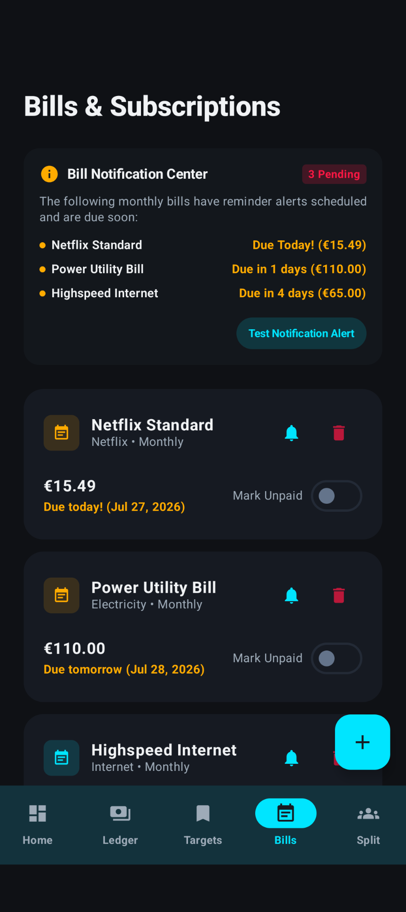
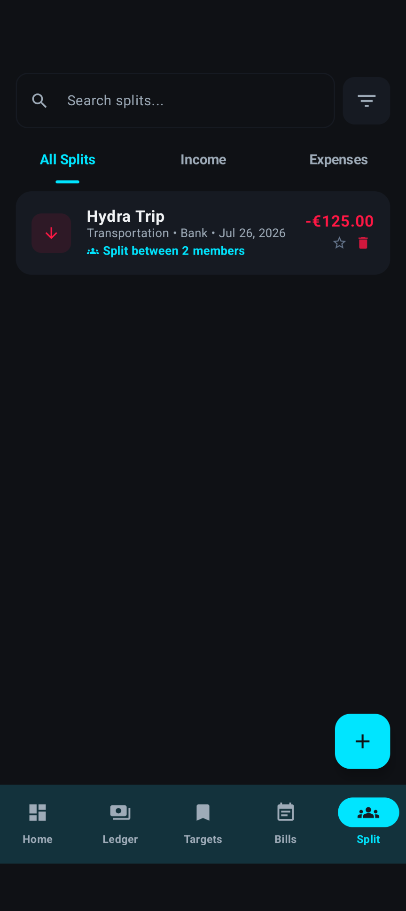

# 💰 BudgetBuddy

BudgetBuddy is a modern Android personal finance application developed using **Java** and **Kotlin** in **Android Studio**. The app helps users manage their finances by tracking expenses, creating budgets, and setting savings goals.

---

## ✨ Features

- 📊 Expense & Income Tracking
- 🎯 Budget Targets
- 💰 Savings Goals
- 🧾 Transaction History
- 🔍 Search Transactions
- 🌙 Modern Dark Theme UI
- 👥 Split Bills
- ⚡ Fast & User-Friendly Interface

---

## 📸 Screenshots

### Home

| Home | Home |
|------|------|
|  |  |

### Ledger

| Ledger | Income | Expense |
|--------|--------|---------|
|  |  |  |

### Targets

| Budget | Goals | Config |
|--------|-------|--------|
|  |  |  |

### Bills & Split

| Bills | Split |
|-------|-------|
|  |  |

---

## 🛠️ Built With

- Android Studio
- Java
- Kotlin
- XML Layouts
- Material Design Components
- SQLite / Room Database (if used)
- Gradle

---

## 📥 Download APK

Download the latest APK from the GitHub Releases page:

https://github.com/Toxiclikith/budgetBuddy-apk/releases/latest

Direct APK download:

https://github.com/Toxiclikith/budgetBuddy-apk/downloads/release/budget-buddy.apk

---

## 🚀 Installation

1. Clone the repository

```bash
git clone https://github.com/Toxiclikith/budgetBuddy-apk.git
```

2. Open the project in Android Studio.

3. Sync Gradle.

4. Build and run the application.

---

## 👨‍💻 Author

Your Name

GitHub: https://github.com/Toxiclikith

---

## 📄 License

This project is licensed under the MIT License.